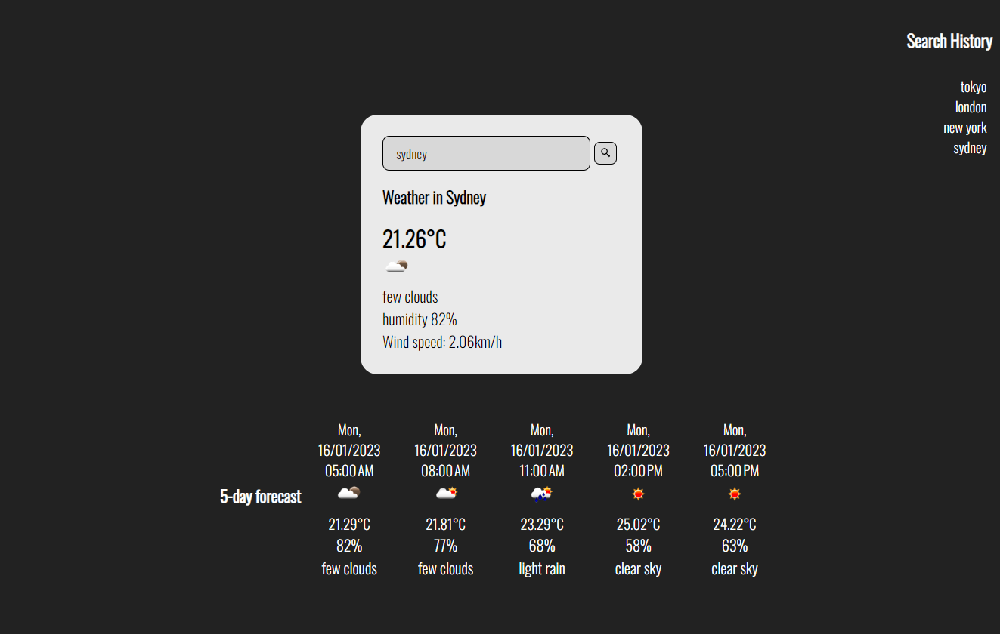

# Weather-Dashboard

## Description

This project was built from scratch using HTML, CSS, JavaScript and an API called openweathermap, it was a great project to apply my current knowlege of code using javascript to dynamically create elements in the DOM and appplying the API to grant user access to data on world wide weather both current and forecasted.

## Installation

N/A

## Usage

To use this weather dashboard you just access the url given and click in the search box and enter any desired city youd like to see the current and forecasted weather for, then either hit the search button or press the enter key and youll be presented with the data, when clicking on a previously searched city youll also be presented with the current and forecasted weather. Check the dev tools on your browser to see the code used, 
Below is an image of the site :

## Credits

N/A

## License

N/A

## Depoyment

[This is an external link to the live site jordannotavailable.github.io/weather-dashboard/](https://jordannotavailable.github.io/weather-dashboard/)